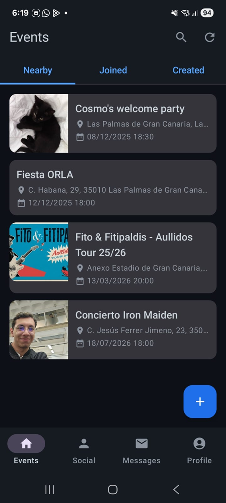
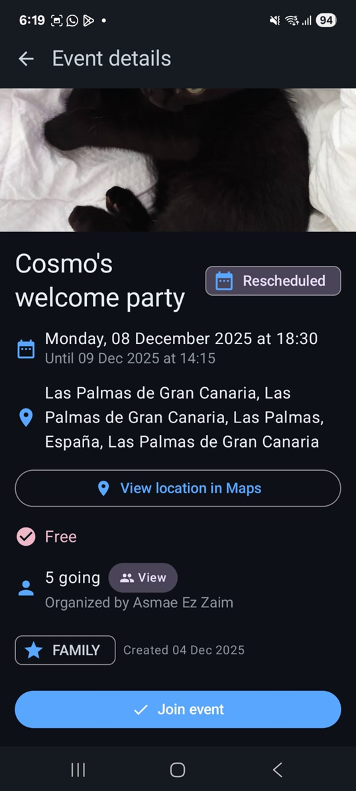
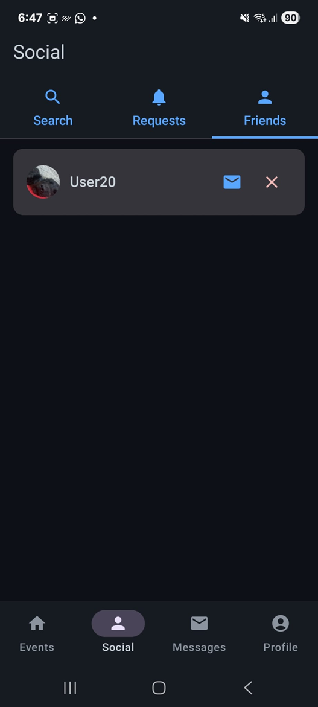

# 📍 WhereWhen

**WhereWhen** es una aplicación móvil desarrollada en **Kotlin** con **Jetpack Compose** que permite descubrir, crear y compartir eventos sociales en tiempo real. Su objetivo es conectar personas a través de actividades locales, ofreciendo una experiencia fluida y moderna con integración completa de chat y búsqueda de eventos por radio según la localización actual.

---

## 🚀 Características principales

- **Descubrimiento de eventos:** Explora eventos cercanos mediante un mapa interactivo.
- **Creación de eventos:** Crea tus propios eventos sociales con nombre, descripción, horario y ubicación.
- **Sistema de amistades:** Agrega y gestiona amigos, con control de solicitudes.
- **Chat en tiempo real:** Comunícate con otros usuarios dentro de cada evento.
- **Notificaciones push:** Recibe alertas de nuevos mensajes, solicitudes y eventos.
- **Gestión de imágenes:** Subida, compresión y caché inteligente de imágenes de perfil y eventos.
- **Diseño moderno:** Interfaz 100% en **Jetpack Compose** siguiendo principios de **Material Design 3**.

---

## 🏗️ Arquitectura

El proyecto sigue el patrón **Clean Architecture + MVVM**, con una clara separación entre capas y responsabilidades.

**Estructura principal:**
```
software.ulpgc.wherewhen/
┣ application/                ← Orquestación y punto de entrada de la aplicación
┣ domain/                     ← Casos de uso, modelos de negocio y definición de puertos
┣ infrastructure/             ← Implementación de adaptadores sobre los puertos definidos en domain
┗ presentation/               ← Pantallas, estados y componentes Compose
```

**Stack tecnológico:**
- **Lenguaje:** Kotlin
- **UI:** Jetpack Compose, Material 3
- **Arquitectura:** MVVM, Clean Architecture, Ports and Adapters
- **Backend:** Firebase
- **CI/CD:** GitHub Actions
- **Testing:** MockK, JUnit
- **Geolocalización:** Location Services

---

## ⚙️ Instalación y configuración

1. **Clona el repositorio:**
   ```bash
   git clone https://github.com/<tu_usuario>/wherewhen.git
   cd wherewhen
   ```

2. **Abre el proyecto en Android Studio**.

3. **Agrega tu archivo `google-services.json`** en:
   ```
   app/src/main/
   ```
4. **Añade tus `API Keys` en `local.properties`:
   ```
   TICKETMASTER_API_KEY=APIKEY
   IMGBB_API_KEY=APIKEY
   ```

5. **Compila y ejecuta** en un emulador o dispositivo físico con Android 8.0 o superior.

---

## 🧩 Variables de entorno y configuración

Para el correcto funcionamiento del proyecto, asegúrate de configurar los siguientes servicios en Firebase:

- Habilitar **Authentication (Email/Google)**
- Configurar **Firestore Database**

Opcionalmente, puedes usar **LocalStack o Firebase Emulator Suite** para desarrollo local.

---

## 🧪 Testing

Ejecuta las pruebas unitarias con:
```bash
./gradlew testDebugUnitTest
```

El proyecto utiliza **MockK** para mocks y **JUnit5** para las pruebas unitarias enfocadas en casos de uso, repositorios y Vies-Models.

---

## ⚡ CI/CD

El flujo de integración continua está implementado con **GitHub Actions**:

- Build y test automáticos en cada *pull request*
- Verificación de formato y dependencias
- Generación de APK de desarrollo

---

## 🖼️ Capturas de pantalla

| Pantalla principal | Detalle de evento | Chat |
|--------------------|------------------|------|
|  |  |  |

---

## 👥 Contribución

Si quieres contribuir:

1. Haz un fork del proyecto.
2. Crea una rama de la feature:  
   ```bash
   git checkout -b feature/nueva-funcionalidad
   ```
3. Realiza el commit y abre un pull request.

---

## 📄 Licencia

Este proyecto se distribuye bajo la licencia **MIT**. Consulta el archivo [`LICENSE`](LICENSE) para más información.

---

## 🧠 Autor

Desarrollado y mantenido por **[Javier Castilla Moreno]**.
Con ayuda de:
 - Alejandro van Baumberghen
 - Aldo Saruni

📍 Las Palmas de Gran Canaria, España  
💼 [LinkedIn](https://www.linkedin.com/in/javier-castilla-moreno-43b7b5321/) | 🖥️ [GitHub](https://github.com/javcastilla)